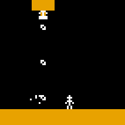
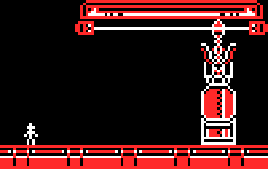

[Return to Home](README.md)

# Object List

## Main/Parent Objects
- **p_bouncer**: When the player touches a p_bouncer object it will apply an external horizontal or vertical speed to it, variables (exthSpeed, extvSpeed)
- **p_death**: When the player touches p_death, they will die and return to their checkpoint
- **p_slow**: When the player is touching p_slow their vertical speed (vsp) will be set to whatever p_slow's variable "slow" is.
- **p_solid**: The solid object parent. Used for creating level geometry.
- **p_water**: When the player is within a p_water region, they can jump infinitely.

## Special Objects for Custom Mode

### obj_cturret
obj_cturret is an object that creates other objects after a certain number of frames. While it's designed specifically to create bullets that shoot in a direction, it could be used to create other objects.

#### • obj_cturret Variables
- **timer**: a timer that increments 1 every frame. You can set this to another number (less than target) to adjust its start time.
- **targ**: the time that `timer` needs to reach to create the object
- **xoff**: used to set the relative xoffset variable at which the instance is created
- **yoff**: used to set the relative yoffset variable at which the instance is created
- **bulsprite**: the sprite that the bullet will be given. default is spr_bullet. This sadly HAS to be an in-game sprite, not a custom one.
- **bulspeed**: the speed which the bullet will travel
- **mapanim**: whether or not to map the animation of the turret to the progress of the firing rate
- **bulobj**: what object to create. default is obj_bullet.

#### • Example
```json
	{
		"type": "obj_cturret",				←define the object
		"sprite_index": "spr_lv14_shootUp",	←define the sprite (can be custom)
		"image_angle": 180,					←define the direction of the object
		"targ": 20,							←define how often it shoots (once per 20 frames)
		"bulsprite": "spr_3x3Bullet",		←define the sprite of the bullet (cannot be custom)
		"x" : 44,							←define the x location of the turret
		"y" : 39,							←define the y location of the turret
		"xoff" : 0;							←this sprite does not require an x offset, but this is where it'd go
		"yoff" : 0							←this sprite does not require a y offset, but this is where it'd go
	},
```
The result:<br>

#### • GML
- Create
```gml
timer=0	//a value that raises by one every frame.
targ=30	//the value that timer has to reach before creating the bullet object
xoff=0	//a relative xoffset for where the bullet is created
yoff=0	//a relative yoffset for where the bullet is created
bulspeed=1		//the speed of the bullet
mapanim=true	//whether or not to map the sprite animation to the progress of timer to targ
bulsprite="spr_bullet"	//the sprite of the bullet, initialized as a string because it will search for the asset
bulobj="obj_bullet"		//the object that the turret will create when timer reaches targ
init=0					//used for an initialization step to let Game Maker catch up on the first frame.

- Step
```gml
if init=0	//initialization only happens once per object
{
	if sprite_exists(asset_get_index(bulsprite))
		bulsprite=asset_get_index(bulsprite)		//find the bullet sprite and assign it
	else	instance_destroy()						//if it doesn't exist, destroy this obj so the game doesn't crash
	
	if object_exists(asset_get_index(bulobj))		//find the bullet object and assign it
		bulobj=asset_get_index(bulobj)
	else	instance_destroy()						//if it doesn't exist, destroy this obj so the game doesn't crash
	init=1
}
timer++	//increment the timer variable one every frame
if mapanim	//if mapanim is true, the sprite will map its animation to the progress of timer divided by targ. Otherwise, use image_speed
{
	image_index=lerp(0,sprite_get_number(sprite_index),timer/targ)
}
if timer>=targ	//once timer has reached the target time, create the bullet
{
	timer=0	//reset the timer so we can repeat this
	var bul=instance_create(x+lengthdir_x(round(sprite_width/2),image_angle)+xoff,y+lengthdir_y(round(sprite_height/2),image_angle)+yoff,bulobj)	//create the bullet instance at the x/y offset.
	bul.image_xscale=1
	bul.image_yscale=1
	bul.direction=image_angle+90	//set the direction of the bullet
	bul.speed=bulspeed				//set the speed of the bullet
	bul.sprite_index=bulsprite		//set the sprite of the bullet
}
```

### obj_cmover
obj_cmover is an object for LOVE Custom that creates an object with custom variables, sets two pairs of x/y coordinates, and them moves between them over time. Sadly this cannot use a custom sprite due to inheritance. I bet someone can do this smarter than me so please feel free to [tweet at me](https://twitter.com/thatsmytrunks) or something.

#### • obj_cmover Variables
- **timer**: a timer that increments 1 every frame. You can set this to another number (less than target) to adjust its start time.
- **targ**: the time that `timer` needs to move from one point to the next
- **locx1**: the starting x location of the object. Set to X by default, so not needed unless you want it for some weird reason.
- **locy1**: the starting y location of the object. Set to Y by default, so not needed unless you want it for some weird reason.
- **locx2**: the target x location of the object's destination.
- **locy2**: the target y location of the object's destination.
- **cobj**: the object index of the object we'll be creating.
- **cspr**: the sprite index of the object we'll be creating. This cannot be a custom sprite. Sorry.

#### • Example
```json
			{
				"type" : "obj_cmover",
				"x" : 66,
				"y" : 45,
				"locx2" : 119,
				"locy2" : 45,
				"targ"	: 53,
				"image_speed" : 1,
				"cobj" : "p_death",
				"cspr" : "spr_lv20_smasher"
			},
```

The result:<br>


#### • GML
Create:
```gml
locx1=x			//the first location's x. set to xstart by default
locy1=y			//the first location's y. set to xstart by default
locx2=x+20		//the second location's x
locy2=y+20		//the second location's y
timer=0			//a variable that increments by one every frame
targ=30			//how long it takes for the object to move from one location to the next (in frames)
wait=5			//how long the object should wait before moving again
con=0			//used as a state varaible.
init=0			//used to initiate the object
myobj=0			//a reserved variable for referring to the created object
cobj="obj_bouncer_indidivual"	//what kind of object to create
cspr="spr_bouncer_individual"	//what sprite to use (must not be a custom sprite)
visible=false					//make this invisible since it's just a controller object
```

Step:
```gml
if init=0
{
	//check to see if the cspr sprite that was defined exists. If not, self destruct to avoid a crash
	if sprite_exists(asset_get_index(cspr))	cspr=asset_get_index(cspr)
	else instance_destroy()
	
	//check to see if the cobj object that was defined exists. If not, self destruct to avoid a crash
	if object_exists(asset_get_index(cobj))	cobj=asset_get_index(cobj)
	else instance_destroy()
	
	sprite_index=cspr	//this is redundant but I set the sprite index here
	myobj=instance_create(x,y,cobj)	//create the cobj, and assign myobj to this.
	myobj.sprite_index=sprite_index	//give the controller object's sprite to myobj
	myobj.image_index=image_index	//set myobj's frame
	myobj.image_speed=image_speed	//set myobj's image speed
	myobj.image_xscale=image_xscale	//set myobj's xscale
	myobj.image_yscale=image_yscale	//set myobj's yscale
	myobj.image_angle=image_angle	//set myobj's angle
	myobj.visible=true				//make sure myobj is set to visible
	init=1							//finish initalizing
}

if !i_ex(myobj) instance_destroy()	//if for some reason myobj is destroyed, self destruct this controller


if con=0
{
	timer++
	
	myobj.x=round(lerp(locx1,locx2,timer/targ))	//set the x based on timer/targ
	myobj.y=round(lerp(locy1,locy2,timer/targ))	//set the y based on timer/targ
	
	if timer>=targ
	{
		myobj.x=locx2	//just in case someone does something funky, put it where it's supposed to go
		myobj.y=locy2
		timer=0			//reset the timer
		con=1			//move to the next step
	}
}

if con=1
{
	timer++
	if timer>=wait	//here we just wait until the timer meets wait
	{
		timer=0
		con=2
	}
}

if con=2	//same as before, but in reverse
{
	timer++
	
	myobj.x=round(lerp(locx2,locx1,timer/targ))
	myobj.y=round(lerp(locy2,locy1,timer/targ))
	
	if timer>=targ
	{
		myobj.x=locx1
		myobj.y=locy1
		timer=0
		con=3
	}
}

if con=3	//wait again, then restart the steps.
{
	timer++
	if timer>=wait
	{
		timer=0
		con=0
	}
}
```


## Full List of Objects

### Gimmick Object List

All objects are tested by spawning them during a level with Shift+I (thus with only default variables set), unless otherwise stated.
- **lv07_movingbouncer_obj**: A moving bouncer from LOVE 2014 Level 07 (Apex). Moves up until it gets near the top of the level, moves down a fixed distance, repeats.
- **lv09_bouncer_obj**: A moving bouncer from LOVE 2014 Level 09 (Jetset). Moves up and down a short distance.
- **lv10_bouncer_obj**: A moving bouncer from LOVE 2014 Level 10 (Lumen). Moves down, eventually leaving the screen.
- **lv11_door_obj**: The door from LOVE 2014 Level 11 (Nickel). Disappears when lv11_switch_obj is made contact with.
- **lv11_switch_obj**: The switch from LOVE 2014 Level 11 (Nickel). On contact, causes all lv11_door_obj in the level to disappear. Crashes the game if touched while no lv11_door_obj is in the level, so avoid placing multiple of these in the player's reach.
- **lv14_plat_obj**: A movable platform from LOVE 2014 Level 14 (Kismet). Snaps back to its original position if player has not been on it for a while.
- **obj_2007_conveyorLeft**: A leftward conveyor from <3 Level 13: Fighting the Current.
- **obj_2007_conveyorRight**: A rightward conveyor from <3 Level 13: Fighting the Current.
- **obj_2007_lv12_down**: A downward bouncer from <3 Level 12: Bumping Rumps. Should be rotated 180 degrees with "image_angle" variable for accurate appearance.
- **obj_2007_lv12_up**: An upward bouncer from <3 Level 12: Bumping Rumps.
- **obj_2007_lv14_conveyor**: A long conveyor from <3 Level 14: Lovely Cavern.
- **obj_2007_lv17_bounce1x**: A standard bouncer from <3 Level 17: Fling.
- **obj_2007_lv17_bounce3x**: A powerful bouncer from <3 Level 17: Fling.
- **obj_2007_lv19_bouncer**: A moving bouncer from <3 Level 19: Rough Rider. Moves down, eventually leaving the screen.
- **obj_24_deathbar**: A deadly, button-removable obstacle from LOVE 3 Level 24 (Ashes).
- **obj_24_deathbar_pop**: Animation of obj_24_deathbar disappearing.
- **obj_bouncer_indidivual**: A small classic bouncer (with a misspelling of individual).
- **obj_bouncer_indidivualXL**: A wide classic bouncer.
- **obj_breakable**: A deadly object that can be broken by gun shots from LOVE 3 Level 13 (Prism). Does not respawn.
- **obj_breakableSolid**: A non-deadly object that can be broken by gun shots from LOVE 3 Level 13 (Prism). Does not respawn.
- **obj_breakableSolidSpawner**: Spawns an obj_breakableSolid in its place after some time has passed, if there isn't already one where it is.
- **obj_downBouncer**: LOVE 3 bouncer facing down.
- **obj_downLeftBouncer**: LOVE 3 bouncer facing down-left.
- **obj_downRightBouncer**: LOVE 3 bouncer facing down-right.
- **obj_goal**: Invisible. Sends you to the result screen on contact. Created by default within the config.json, but you can create other obj_goal areas in a level to trigger the end of a stage.
- **obj_leftBouncer**: LOVE 3 bouncer facing left.
- **obj_love_01_movingPlat**: A pillar that collapses when you land on it, from LOVE Remastered Level 01 (Nocturne). Unlike the 2014 equivalent, lv01_fallingPlat_obj, this is solid from all sides, and can only be lowered by landing on top. You get one frame to jump after landing on it.
- **obj_love_07_bouncerMoving**: A moving LOVE 3 bouncer from LOVE Remastered Level 07 (Apex). Similar behavior to lv07_movingbouncer_obj.
- **obj_love_10_bouncerOnPath**: A moving bouncer from LOVE Remastered Level 10 (Lumen). Moves down, eventually leaving the screen.
- **obj_love_11_disaplat**: The door from LOVE Remastered Level 11 (Nickel).
- **obj_love_11_trigger**: The switch from LOVE Remastered Level 11 (Nickel). On contact, causes all obj_love_11_disaplat in the level to disappear. Crashes the game if touched while no obj_love_11_disaplat is in the level, so avoid placing multiple of these.
- **obj_love_14_movePlat**: A movable platform from LOVE Remastered Level 14 (Kismet). Moves back to its original position if player has not been on it for a while.
- **obj_love_15_tele1**: A portal (with no graphics) from LOVE Remastered Level 15 (Kingpin). Crashes the game on contact. Might be able to set targx and targy to specify target destination?
- **obj_love_16_lv5Plat_A**: A disappearing/reappearing platform from LOVE Remastered Level 16 (Metric) that isn't baked into level geometry, yay!
- **obj_love_16_lv5Plat_B**: Same as obj_love_16_lv5Plat_A, but on an opposite cycle.
- **obj_love_16_movePlat**: Mimic of obj_love_14_movePlat from LOVE Remastered Level 16 (Metric).
- **obj_love09_bouncer**: A LOVE 3 bouncer that moves up and down a fixed distance. Used in LOVE Remastered Level 09 (Jetset).
- **obj_love09_bouncer_1**: Like obj_love09_bouncer, but with a slightly smaller distance.
- **obj_love2007_6pxBouncer**: A classic bouncer, which, bizarrely, is 7 pixels wide.
- **obj_love2007_7pxBouncer**: Seemingly identical to obj_love2007_6pxBouncer.
- **obj_love2007_7x4Bouncer_move**: A 7x4 classic bouncer that moves up and down a short distance. Bounce goes higher than obj_love2007_6pxBouncer. Also makes a higher-pitched sound effect.
- **obj_love2007_7x4Bouncer_static**: obj_love2007_7x4Bouncer_move, but doesn't move.
- **obj_love2007_8pxBouncer**: A classic bouncer that is 8 pixels wide.
- **obj_love2007_9x4**: A 9x4 classic bouncer. Same bounce height and sfx as obj_love2007_6pxBouncer.
- **obj_love2007_fan**: The upward force present above certain platforms in <3 Level 03: Watch out for Spikes. Invisible.
- **obj_love2007_lv01_fallingplat**: A fake-out platform from <3 Level 01: Frustration. Moves down slowly after being stepped on. Can be jumped off of.
- **obj_love2007_lv04_bouncer**: A 2007 bouncer.
- **obj_love2007_lv07_fallingplat**: A stretch of ground that crumbles when you step on it, from <3 Level 07: Caution: Dirty Water. Regenerates after a while, or once you die.
- **obj_love2007_lv08_bouncers**: A moving bouncer from <3 Level 08: Mega Mission. Moves up until it gets near the top of the level, moves down a fixed distance, repeats.
- **lv01_fallingPlat_obj**: A fake, nonsolid platform that falls when the player touches it. Found in LOVE 2014 Level 01 (Nocturne).

### Visual Objects
These objects are animations and other mainly visual objects. Some of them might have reusable animation styles that could use a sprite swap.

- **lv01_fallingPlat_obj**: A fake, nonsolid platform that falls when the player touches it. Found in LOVE 2014 Level 01 (Nocturne).
- **lv06Decor_obj**: The "CONTAMINATION WARNING" sign in LOVE 2014 Level 06 (Miniature).
- **lv13_decor_obj**: The spinning gear from the center of LOVE 2014 Level 13 (Galactic).
- **lv15_teleporterDecor_obj**: The animation of a teleporter in LOVE 2014 Level 15 (Kingpin).
- **lv5_decorativeRotators_obj**: A decorative thingy from LOVE 2014 Level 05 (Tofu).
- **obj__lv13_survivorAnimation**: Two survivors sitting in a purple box, from LOVE 3 Level 13 (Prism).
- **obj_24_backingDrill**: Part of a drill from LOVE 3 Level 24 (Ashes).
- **obj_blackOverlay**: A 2x2 black box that renders over everything else, including fiveEight.
- **obj_bubblespawner**: Occasionally spawns a bubble if placed in water.
- **obj_carrierExplode**: Animation of an enemy helipod exploding, used in LOVE 3 Level 14 (Fearless).
- **obj_dust**: Dust particle.
- **obj_dustlittle**: Small dust particle.
- **obj_fireworks**: Particle tester left in the game. Spawns a particle of a random color and size that moves in a random direction and lasts for a random duration.
- **obj_levelHard_stationaryDiamond**: A decorative background diamond from kuso's Bonus Level.
- **obj_love_01_decor1**: A barber shop pole from LOVE Remastered Level 01 (Nocturne).
- **obj_love_01_wireDecor**: A hanging wire from LOVE Remastered Level 01 (Nocturne). Includes the ceiling above it, which disappears for part of its animation.
- **obj_love_04_cake**: Hidden cake from LOVE Remastered Level 04 (Kid).
- **obj_love_04_decor2**: A dot that moves back and forth. Used to denote the edges of the slow fall tube in LOVE Remastered Level 04 (Kid).
- **obj_love_04_decor2_1**: Seemingly identical to obj_love_04_decor2.
- **obj_love_05_crusherDecor**: Appears above crushers in LOVE Remastered Level 05 (Tofu).
- **obj_love_05_decor**: A nicer version of lv5_decorativeRotators_obj, used in LOVE Remastered Level 05 (Tofu).
- **obj_love_05_decor2**: obj_love_05_decor on a different cycle.
- **obj_love_07_decor1**: Flickery chevron from LOVE Remastered Level 07 (Apex).
- **obj_love_11_dripper**: Another water dropper, this time from LOVE Remastered Level 11 (Nickel).
- **obj_love_11_pulse1 (1-7)**: A gentle reminder that the monster in LOVE Remastered Level 11 (Nickel) is alive.
- **obj_love_11_triggerDisappear**: Animation of the switch in LOVE Remastered Level 11 (Nickel) disappearing. Makes a sound effect when spawned.
- **obj_love_12_spinner**: Source of bullets in LOVE Remastered Level 12 (Suburb).
- **obj_love_12_waterDecor**: Decorative sparkly water from LOVE Remastered Level 12 (Suburb).
- **obj_love_15_teleDecor**: Animation for portals in LOVE Remastered Level 15 (Kingpin). Same as obj_love_15_teleDecor, but with a slight offset in the cycle.
- **obj_love_16_sawDecor**: Decorative pivot for the stationary saws in LOVE Remastered Level 16 (Metric). Attaches to a wall.
- **obj_love_16_waterDecor1**: Bottom 4 strips of obj_love_12_waterDecor, used in LOVE Remastered Level 16 (Metric).
- **obj_love08_sawDecor**: A vertical dotted line indicating obj_love08_bouncingSaw's ordinary travel distance.
- **obj_love16_laserDecor**: A purely decorative laser found in LOVE Remastered Level 16 (Metric).
- **obj_love2007_lv04_sawholderDecor**: Presumably a decorative pivot for stationary saws in <3 Level 04: Hack and Dash, but doesn't show up in that level; nor do stationary saws. Renders in front of the player. Attaches to a floor.
- **obj_love2007_lv05_decor1**: In a feat of remarkably intuitive design, this is the actual text "SLOW TUBE" between two horizontal lines, which marks the beginning of the slow tube in <3 Level 05: Murder.
- **obj_love2007_lv05_decor2**: The text "END" between two horizontal lines, marking the end of the slow tube in <3 Level 05: Murder.
- **obj_love2007_lv07_decor**: A pipe crack in <3 Level 07: Caution: Dirty Water. Also works as a small leftward arrow. It's 2x3 pixels.