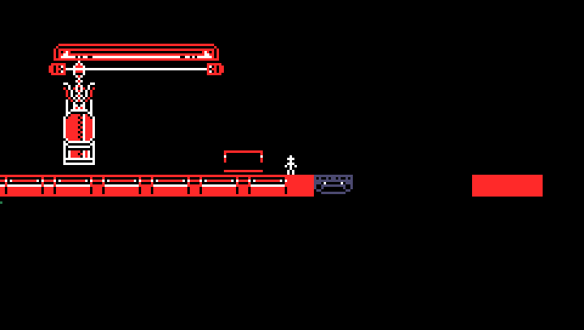
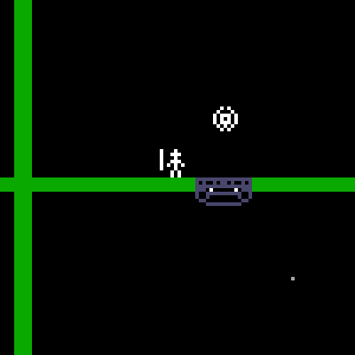

[Return to Home](README.md)
# Object Sets
LOVE 3's objects were much more complicated than previous games and interacted with each other a lot more. Here I'm going to try and explain some of them so that can be repurposed by folks to create intricate custom levels. As always, if something doesn't make much sense, please come ask for help in the Discord so we can help you, and then make this documentation better for everyone. Also if you have some sort of fun idea for a way to manipulate any of these, I can always try to make custom versions of them that take additional variables.

## LOVE 3 Level 2's Moving Platform
These are made of three parts, two of which are required. It allows you to create a horizontally moving platform controlled by an invisible switch with optional decor.

### obj_lv2_movingPlat
This is a solid object that will move horizontally until it meets another solid object, then will reverse. It is required.

### obj_lv2_movingPlatTrigger
This is an invisible trigger area that will tell `obj_lv2_movingPlat` to be active. This is also required.

### obj_lv2_movePlatTriggerDecor
This is a visual object that displays and animates while standing in `obj_lv2_movingPlatTrigger`'s area. It is not required.

### Example
Here's a very ugly example of how to call and customize these objects.
```json

            {
                "type": "obj_lv2_movingPlat",
                "x" : 172,
                "y" : 92,
                "sprite_index": "cspr_moverplat"
            },
            {
                "type": "obj_lv2_movingPlatTrigger",
                "x" : 138,
                "y" : 77,
            },
			{
                "type": "obj_lv2_movePlatTriggerDecor",
                "x" : 136,
                "y" : 83,
                "depth" : -1,
                "sprite_index": "cspr_moverdecor"
            },
```
In Action:<br>


## LOVE 3 Level 3's exploding doors
LOVE 3 Level 3 has two doors that will explode once you collect their key. One set is `obj_lv03_key1` & `obj_lv03_door1`, and the other`obj_lv03_key2` & `obj_lv03_door2`.

### obj_lv03_key1 / obj_lv03_key2
This is a static object that when collected by the player will tell `obj_lv03_door1` to obliterate.

### obj_lv03_door1 / obj_lv03_door2
This is a static solid object that will explode once `obj_lv03_key1` is collected.

### Example
```json
			{
				"type": "obj_lv03_key1",
				"x" : 834,
				"y" : 30
			},
			{
				"type": "obj_lv03_door1",
				"x" : 829,
				"y" : 50,
				"sprite_index" : "cspr_moverplat",
			},
```
In Action:<br>

