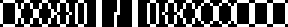
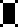

# Sprite Variables

You can set up your own sprites in your levels' config.json, and it requires a few variables. Most of the time you can just leave everything the way that it is, changing the path and frames, but if you want to know a little more about what everything means, here's some information.

Let's take this example entry:
```
"path": "custom/template/solid.png",
"frames": 1,
"originX": 0,
"originY": 0,
"tag": "cspr_solid",
"removeback": 0,
"bbox":
{
     "sepmasks": true,
     "bbmode": "automatic",
     "bbleft": 0,
     "bbtop": 1,
     "bbright": 1,
     "bbbottom": 1,
     "bbkind": "precise",
     "bbtolerance": 0
     }
```

### path
- 
The location of the sprite, relative to the location of the game's executable file. This must be encased in quotations and use /, not \.

### frames
- How many individual frames are in the sprite. The game imports sprite strips as horizontal strips of images. To create an animated sprite,
- An example image strip with 16 frames:<br>

- The way the sprite will be shown in game:<br>

### originX / originY
- These will set the x and y offsets of the sprite you're importing. Read this for more information about x/y origins.

### tag
This is the name that you will use when creating an object with a custom sprite_index value. Example: `"sprite_index": "cspr_solid",`

### removeback
- Indicates whether to make all pixels with the background color (decided by the left-bottom pixel of the image) transparent. The best practice for this is to use transparent PNG files and set this to 0, but in situations where you want to use a flat colored background while working on your level, you can set this to 1. LOVE 3 may remove the background improperly though, so use this at your own discretion.

### bbox
This section refers to the bounding box of the sprite, and 99% of the time you're not going to want to change any of these values. But to explain what each does, here's some information pulled from Game Maker's documentation:

**sepmasks**
- Whether to create collision masks for each sub-image of the sprite (true), or one mask for all (false).
**bbmode**
- This is the bounding box mode. I really recommend leaving this to automatic. Read more.
**bbleft**
- The maximum left position of the bounding box.
**bbtop**
- The maximum top position of the bounding box.
**bbright**
- The maximum right position of the bounding box.
**bbbottom**
- The maximum bottom position of the bounding box.
**bbkind**
- The kind of mask `"rectangular"`, `"ellipse"`, `"diamond"`, `"precise"`
**bbtolerance**
- Indicates the tolerance in the transparency value (0=no tolerance, 255=full tolerance).